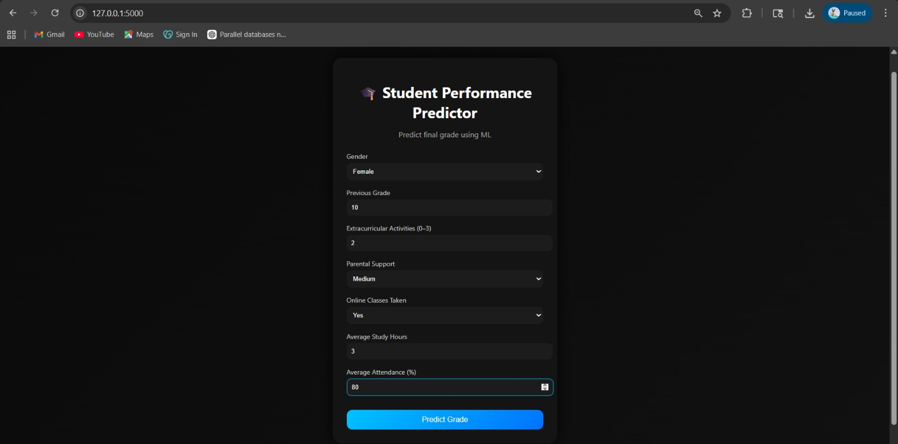
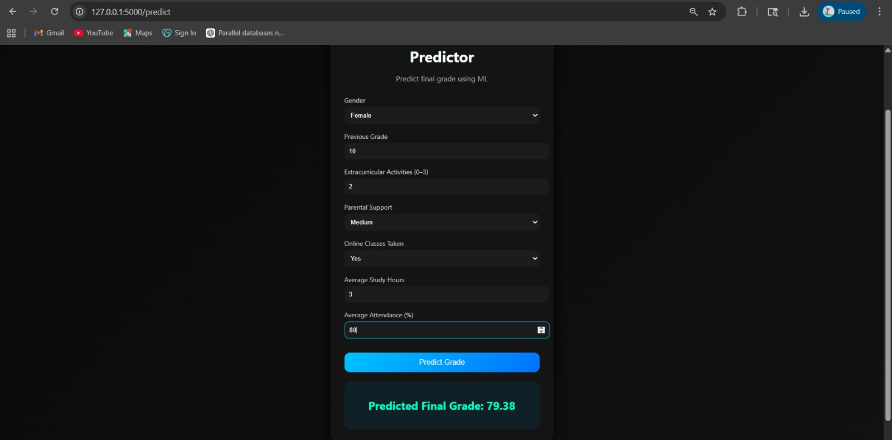

# 🎓 Student Performance Predictor

This project is a simple machine learning web application that predicts a student’s final grade based on factors like study habits, attendance, and background information.

It was built as part of a Data Science & Analysis project to understand how machine learning models can be used in real-world applications.

---

## 💡 What this project does

The application takes inputs such as:
- Previous grade
- Study hours
- Attendance
- Parental support
- Extracurricular activities
- Online classes

Based on these inputs, it predicts the student’s final grade using a trained ML model.

---

## 🧠 Model used

I used a **Random Forest Regressor** for this project because it gives better performance compared to basic models.

Steps involved:
- Encoding categorical data (gender, parental support)
- Handling missing values
- Feature engineering (average study hours and attendance)
- Model training and evaluation

---

## 🛠️ Tech stack

- Python  
- Pandas & NumPy  
- Scikit-learn  
- Flask  
- HTML & CSS  

---

## 📂 Project structure

DSA_CCA3/
│
├── app.py  
├── model.pkl  
├── student_performance.csv  
│  
├── templates/  
│   └── index.html  
│  
├── static/  
│   └── style.css  
│  
└── README.md  

---

## ▶️ How to run

1. Install dependencies:

pip install flask numpy pandas scikit-learn  

2. Run the app:

python app.py  

3. Open in browser:

http://127.0.0.1:5000/  

---

## 📸 Screenshots

### 🖥️ Home Page

### 📊 Prediction Result

---

## 📌 Example

Input:
- Previous Grade: 10  
- Study Hours: 3  
- Attendance: 80  

Output:
Predicted Final Grade: 88.3  

---

## 🚀 What I learned

- Working with real-world datasets  
- Training and evaluating ML models  
- Integrating ML with a web app using Flask  
- Building a simple frontend + backend system  

---

## 🔧 Future improvements

- Add charts/visualizations  
- Improve UI further  
- Deploy the project online  
- Try advanced ML models  

---

## 👩‍💻 Author

Apurva Dighe
